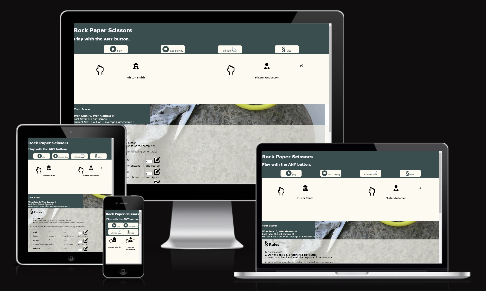
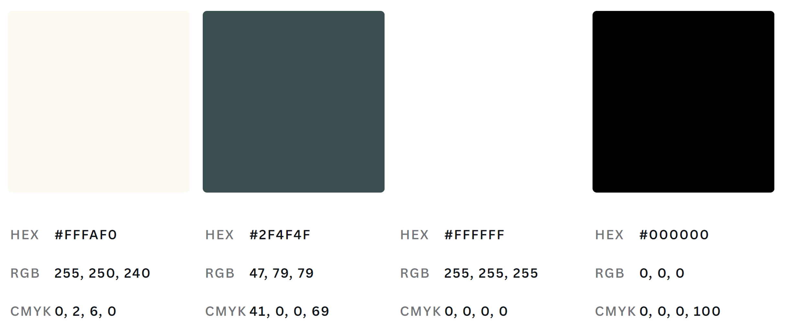
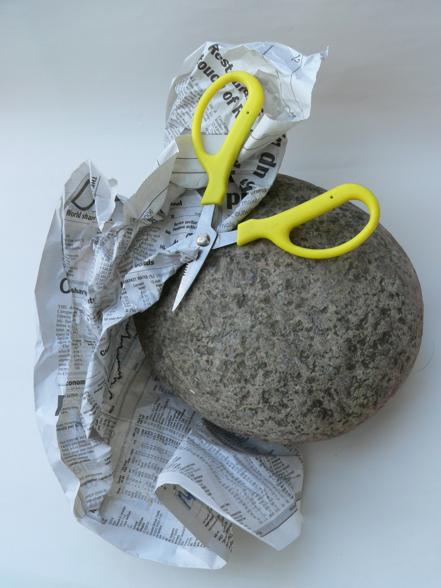
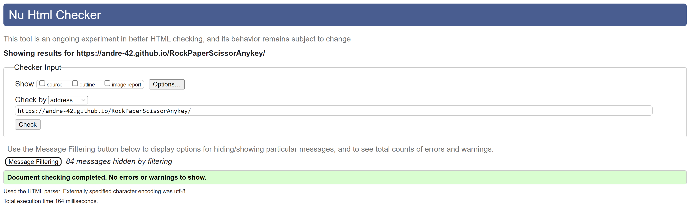
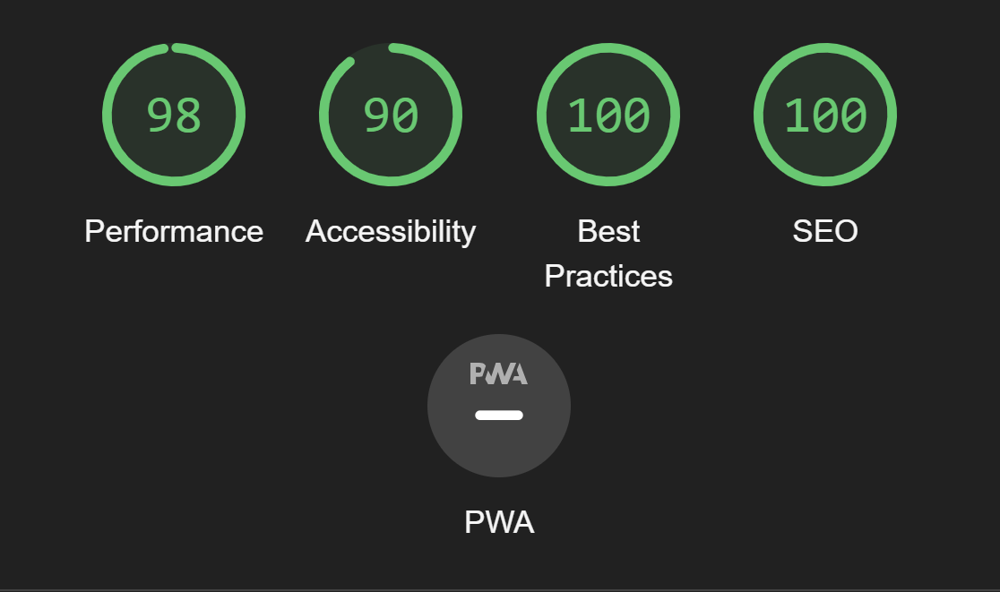
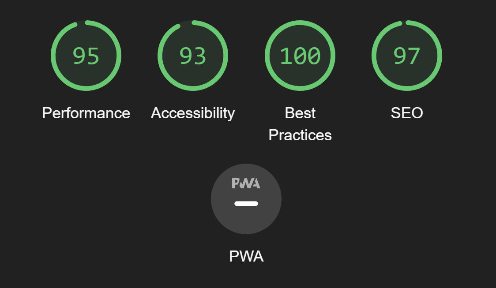

## Rock, Paper, Scissors ... ANY key

Welcome,

Visit the deployed site: [Rock, Paper, Scissor, Anykey](https://andre-42.github.io/RockPaperScissorAnykey/)

## Contents

* [General Intent](#general-intent)
    * [Concept](#concept)
    * [Usage](#usage)
* [Design](#design)
    * [Color Scheme](#color-scheme)
    * [Typography](#typography)
    * [Imagery](#imagery)
    * [Wireframes](#wireframe)
    * [HTML And CSS Features](#features)
    * [Accessibility](#accessibility)
* [Deployment And Local Development](#deployment--local-development)
    * [Deployment](#deployment)
    * [Local Development](#local-development)
* [Testing](#testing)
    * [Solved Bugs](#solved-bugs)
    * [Known Bugs](#known-bugs)

## General Intent

This is my second project at the code institute. The core of this project is the java script functionalization of a front-end website. For this reason I chose the game "rock, paper, scissors, spock". However I put a little twist on it and added the "any key" move. As pretty much everybody knows the phrase: "Press any key to continue."

### Concept

- **Pass your time:** This game is just a little gadget to get distracted, have a few minutes for yourself and than you can push on in your endeavors of the day.

- **Informative Content:** There is not much informative content necessary for the game. Once you play, your score is tracted and you can see how you do. Of course you can inform yourself about the rules of the game in a seperate section of the site or check my contact links if you feel the need to learn more about me or get in touch.

- **Visual Presentation:** I use visual aids, images and well-structured content with a simplistic design. The website is designed with clarity and user-friendliness in mind. It is supposed to look a bit old fashioned and gray just as the keyboards in the 90s.

- **Accessibility:** This is a pass time endevour. So it is accessibile to everyone and in particular to any key users.

- **Future Intent:** This website is intended to give a place to get a few moments to yourself, recoupe by playing a simple game and than power on. Thus, future developments will likely add additional game play features to diversify gameplay options.
This can include features like randomized button configuration (placement and size) or moving buttons to make the game more interesting for mobile devices.

### Usage

1. Visit the [Rock, Paper, Scissor, Anykey website](https://andre-42.github.io/RockPaperScissorAnykey/).
2. Press play and off you go.
3. Pause your game or reset it using the pause and stop button.
4. Read the rules if you are not familiar already.
4. Contact us if you have a cool idea to improve the game.

## Design

### Color Scheme

Back in the 90s, keyboards were pretty dull. I wanted to capture that vibe in the appearacne of the game. So I chose a relatively simple and contrasting dull color scheme. The palette was created at [Canva] (https://www.canva.com/colors/color-wheel/).

* I have used #fffaf0 and #2f4f4f as the main background colors for alternating sections.
* They are slightly transparent to allow the background image to show through for some decorative effect.

* Writing is done in contrasting colors to the background color.
* Fallback colors in the body are white and black.

### Typography

Standard build in fonts Verdana and Times New Roman as backup were used.

### Imagery

Icons for buttons are sourced from [Fontawesome](https://fontawesome.com/) when freely available. The additional wormhole icon was sourced from [Flaticon](https://www.flaticon.com/free-icons/wormhole) and the ANY key icon was made in powerpoint and saved as png to allow for transparency when necessary.

Variations of it were created to be used as favicon or winning icon template (gold filled inner space).
The background image was sourced from [Freeimage](https://www.freeimages.com/photo/rock-paper-scissors-2-1241086).

### Features

The website is comprised of a home page that includes all features.

The page is responsive and has:

* A favicon in the browser tab.

#### Header
* The main title, a secondary title and menu buttons are located in the header. 
* The navbar is located under the title. The cursor changes when hovering over a button/link.

Depending on the screen orientation and size, it will switch between a 2x2 and a 1x4 button arangement. 

The same is true for move buttons in the game section.
* The play button activates the game and reveals the move buttons in the gaming area. Once a game is active the editing icon next to the player icon is hidden. Additionally the icon of the play button changes to pause. 
* Once pause is pressed the move buttons are hidden again and the editing icon next to the player is available again.
* The stop button resets the score board below the gaming area.
* The rules button will take you to the rules section of the website.

#### Gaming Section
* The section is organized into 3 areas:
    - pc player icons
    - player icons
    - control panel
* The pc and player icon sections are made up of 2 fontawesome icons each. One representing the pc which is Mr. Smith and the player Mr. Anderson by default.
* While the game is paused it is possible to change the players name by clicking on the edit icon next to the player. This will reveal a input box that the user can write into to change the name. After clicking on the floppy disc icon the name changes are registered and the input box is hidden again. This feature is hidden when actively playing.
* Each player has a closed hand in front and to the left of themself as a representation of the hand for playing rock paper scissors. While the mouse is hovering over the game section these hands begin to shake as if they are ready for play. This feature is hover based and thusfar I haven't been able think of a good solution to make this feature responsive on touch displays without a mouse.
* In play mode the hands next to the player will change to their selected moves once you choose one for yourself. The winning move will be highlighted in gold while the loser will have a white background and become slightly transparent.
* The control panel is by default hidden when the game is stopped or in pause mode.
* Once you press the play button in the header you are able to play by clicking on the icons that just poped up in the control panel section below the player icons. You can pause at anytime by pressing the pause button in the header.
* Clicking on any of the available choices will lock your selection after which the computer will choose a move at random from the moves that are available. After both selections are made you will see the winner as described before. If a draw is reached both hands next to the player will have a white background and no transparency.
* Once you start moving the mouse away from the selection you have made, the player hands will switch back to shaking fists in order to demonstrate that they are ready for the next round. Again this feature only really works when having a hoverable mouse as touch screens can't track the finger once it looses contact with the device.
* The ultimate anykey button will ramp up the stacks by allowing the pc player to not just play random but anticipate your next move by learning from your previous behaviour. In normal play the pc chooses randomly from the available selection of moves. These are defined in a JS list variable. When enabling the ultimate anykey button your last selection is added to the available movements list for the pc. This list will save the standard moveselection and one optional winning move for your last 100 moves if you play that long. Thus, if you play in this mode the randomization of the pc player will be biased towards the winning moves of your selections. However if you are fast enough (<0.5s hovering on your selection befoe selecting it>) the pc will not track your movement. 

#### Score Sheet
The score sheet is a vital part of the gaming function. 
* The primary function is the one you see on the website, which is showing you your results in the game.
* The game is scored as 3 out of 5 games. Thus it tracks your game in such increments of max. 5 games per set. However if you win the first 3 rounds in one 1 it will see that set concluded and start the next set of games, since the opponent would not be able to win that set if you already lead 3 to 0 out of 5.
* This is why you see an output for won sets and games, lost sets and games, your current wins out of a set and your average score per set.

#### Rules Section
The rules section is what it says it is. 
* Here you can find the rules of the game i.e., what move wins against which other moves. As you could play with a keyboard in anykey mode the game checks also for keyboard inputs during the active anykey game as responses to movement selection.
* Here you can define the input key for the available movements by editing the input fields after clicking the edit icon.

#### Footer
The footer has a hidden section as well as the affiliated links to my facebook, github and linked in which open in a seperate tab.
* The hidden section is responsible for movement tracking. This is where JS stores how often you have used which movement by writing your movement counts into a table. Additionally it saves your last active movement, and the duration it was active for. This information is processed during the pc player move selection to bias the random move selection if all criteria are met.

#### JS functions running website features

In order to run this game a lot of minor an major functions need to be coordinated in JS. All functions were created individually by myself. Inspiration for functionalities came from provided course material of Code Institute or from browsing thru tutorial sides, w3schools.com and developer.morzilla.com. No external libraries were used to create the code in order to remain as original to my own approach as I could.

The script initiates several global variables to run throughout the game in order to not initiating them every time a function is called. Afterwards the script uses several event listeners to listen for clicks, active hovering and leaving an active item. According to the output of these listeners the runGame() function is initiated with a todo command or countTime(), endTime() and shakeAgain() are initiated. Keyboard inputs are presented to either runGame() or commitInput().

##### JS functions

* runGame() initiates the functionality of the entire html according to the todo information. Which is a command word to initiate different functionalities. This is done by checking which command is given with a loop and if statements to call functions.
* play() changes the play button to its pause icons and activates the shaking hand command.
* pause() reverses the effect of play.
* stop() resets the play button to its default and changes the values in the score sheet back to 0.
* anykeyMode() changes the logical value ultimateKeyEnabled to its opposite and changes the 'ultimate ' button style.
* keyInputTranslate() translates the keyboard input to game moves according to the keyboard values declared in the rules section.
* commitInput creates an id variable for keyInputTranslate() to function. It also checks keyboard inputs to not be void and takes the original input instead.
* playerID() changes playername between edit and save mode.
* changePlayerName()  checks the form input if it is a valid name (not empty) and changes the input to its original state if it was invalid.
* endTime() takes the exit time from the last hover/active item. 
* scoreHand() initiates the scoring of a round by aquiring the players move , evaluating the time it took the player for the choice and initaiting the pc to choose in pcHand(). After recieving both scores it calculates if the player wins, looses or it was a draw and creates the appropriate icon design for both players hands as well as updating the result sheet.
* pcHand() selects a move choice for the pc. If the player took too long and ultimate mode is enabled it will add the winning options to the list of possible draws and than select a random draw. Under normal condition the random selection is unbiased while under 'ultimate' mode the selection of choice will be scewed towards the player selection history.
* findWinner() performs the visual changes to the game section under the scoreHand() function.
* resultColor() is a support function for findWinner to determine the background color of the played icon.
* shakeAgain() sets the players hand to a shaking hand in between draws during the active game.

Many of these function automatically react to user input thus proactive user input is minimized to the essential actions and therefor users will likely not notice the extensive changes which take place while they play.

## Technologies Used

### Languages Used

HTML, CSS, Javascript

### Frameworks, Libraries & Programs Used

* Am I Responsive?: display website responsiveness
* CodeAnywhere: IDE for site creation
* Powerpoint: for icon creation
* Favicon.io: favicon creation
* Git: version control
* Github: file storage for website and repository template
* GitPod: IDE for site creation
* Google Fonts: font-family import
* Google Developer Tools: troubleshooting, feature testing, styling 
* iloveimg.com: image compression
* Webpage Spell-Check: chrome extension for spell checking
* Lighthouse (Google): Accessibility testing
* Jigsaw: CSS testing
* W3C HTML Validator: html testing
* JShint: testing JS script syntax

Some default assets may be missing from the list. This may be if I am unaware of there use in background operations during the creation of the project and I have not used them actively.

## Deployment

The site is deployed using GitHub Pages - [Rock, Paper, Scissor, Anykey](https://andre-42.github.io/RockPaperScissorAnykey/).

To Deploy the site using GitHub Pages:

1. Login (or signup) to Github.
2. Go to the repository for this project, [Andre-42/RockPaperScissorAnykey](https://github.com/Andre-42/RockPaperScissorAnykey).
3. Click the settings button.
4. Select pages in the left hand navigation menu.
5. From the source dropdown select main branch and press save.
6. The site has now been deployed, please note that this process may take a few minutes before the site goes live.

## Testing

Please refer to [TESTING.md](TESTING.md) file for all testing carried out.

Testing was ongoing throughout the entire build. I utilised Chrome developer tools whilst building to pinpoint and troubleshoot any issues as I went along.

During development I made use of google developer tools to ensure everything was working correctly and to assist with troubleshooting when things were not working as expected.

I have gone through each functionality using google chrome developer tools and applied the different mobile and desktop screen simulations within that tool.

### AUTOMATED TESTING

#### W3C Validator

[W3C](https://validator.w3.org/) was used to validate the HTML on all pages of the website. It was also used to validate the CSS.

* [index.html](index.html)
 - Passed.
* [style.css](assets/css/style.css)
[style.css](assets/documentation/w3c-validator-css.png) - Passed.

- - -

#### JavaScript Validator

[jshint](https://jshint.com/) was used to validate the JavaScript.

* [script.js](documentation/jshint.png) - Passed, with 62 warnings regarding version availability:
    - 'let' is available in ES6 (use 'esversion: 6') or Mozilla JS extensions (use moz)
    - Metrics:
        There are 21 functions in this file.
        Function with the largest signature take 2 arguments, while the median is 1.
        Largest function has 45 statements in it, while the median is 8.
        The most complex function has a cyclomatic complexity value of 14 while the median is 2.

- - -

#### Lighthouse

I used Lighthouse within the Chrome Developer Tools to test the performance, accessibility, best practices and SEO of the website.

##### Desktop Results

Each page is achieving a score of at least 90 for accessibility and best practise.

##### Mobile Results

Each page is achieving a score of at least 93 for accessibility and best practise.

- - -

### Full Testing

Full testing was performed on the following devices:

* Laptop:
  * ASUS Vivobook Pro 16x OLED
* Mobile Devices:
  * iPhone SE 2.

Each device tested the site using the following browsers:

* Google Chrome
* Safari

### Manual Testing

`Home Page`

| Feature | Expected Outcome | Testing Performed | Result | Pass/Fail |
| --- | --- | --- | --- | --- |
| The Sites title | Title changes dimensions responsive to viewing device and not constrict other sections of the html. | Checked different devices in developer tools on chrome. | Header does not obscure other content | Pass |
| Header buttons | Buttons organize according to screen size and orientation | Checked different devices in developer tools on chrome. | Buttons are oriented as expected either in 1x4 or 2x2 configuration. | Pass |
| Play button | Button switches to pause image when pressed and the control buttons for the game become visible while the player name editing button is hidden. | Press the button. | Playing function is enabled and necessary buttons are visible. Edit name button is hidden and play button shows pause configuration. | Pass |
| Pause button | Button switches to play image when pressed and the control buttons for the game become invisible while the player name editing button is enabled. | Press the button. | Playing function is disabled and necessary buttons are hidden. Edit name button is enabled and pause button switches to play configuration. | Pass |
| Stop button | Button clear result section and resets it to 0. This has no effect on page load but will change displayed information after playing previously. | Press the button. | Expected outcome is reached. | Pass |
| Rules button | Button focusses page display on rules section. | Press the button. | Expected outcome is reached. | Pass |
| Edit player name icon | Pressing the edit icon in disabled play mode unhides an input form to change the player name. After pressing the button the icon changes to a floppy disk. | Press the button. | Expected outcome is reached. | Pass |
| Edit player name input form | Type different name into the form | Typed a new name in. | Name is changed to form input after saving with the floppy disc icon. | Pass |
| Save player name icon | Pressing the edit icon in disabled play mode unhides an input form to change the player name. After pressing the button the icon changes to a floppy disk. Pressing the floppy disk icon will hide the input form and change the player name according to the input. | Press the button. | Expected outcome is reached. | Pass |
| Gameplay | Play the game by pressing buttons for different moves. Chnages in hand icons should be achieved according to who wins and loses. | Play the game. | The game runs smoothly. Every hand can be executed and a win/draw/loss depiction by style changes is executed as intended. The score sheet is updated automatically. In desktop mode the hands switch back to shaking fists [video](assets/documentation/shaking-hands.mp4) when not selecting and icon but changing the mouse position. This feature is not achievable in modile mode. | Pass |
| Keyboard usage | Change keyboard annotation in the rules section. | Press the edit button, edit the key, and press the edit icon again to save. | Expected outcome is reached. | Pass |
| Social media links | Pressing the links in the footer opens a new tab with the appropriate content | Press the links | Expected outcome is reached. | Pass |

### Solved Bugs

| No | Bug | How I solved the issue |
| :--- | :--- | :--- |
| 1 | Alignment and overflow issues were observed between different screen sizes. | I identified breakpoints for screen widths where such alignmentent issues occured and implemented css rule changes regarding display options, margins and padding. This issue was very obvious when fontawesome icon were combined with image icons in the same layout. They seem to align with different reference properties which was fixable when using absolute reference locations instead of relative.  |
| 2 | Ultimate mode is causing a problem in runGame(). | I identified that the if construct checks the innerText for 'ultimate' instead of 'ultimate ' as keyword. Thus the function performs the wrong task selection which leads to errors in downstream function. Ultimate function is working properly after this declaration was corrected.  |

#### HTML And Essentials Assessment Result Fixes
| Criterion | Issue | How I solved the issue |
| :--- | :--- | :--- |
| 1.2 | Further accessibility considerations will need to be made to meet this criterion. | Added missing aria-labels to buttons and input features to improve accessibility which tests now in lighthouse over 90%. |
| 1.4 | Information is varying across different pages resolutions or devices. | Adjusted css rules for each section to allow for similar transparency ratios. This allows for a slight visibility of the background image, while still enabling a strong foreground contrast. Color scheme is also supporting strong contrast. |
| 2.2 | Fails to pass through the official (W3C) validator. | Correction to both css and html have been made. It now passes all vaildators. See testing. |
| 2.Additional | Ensure that favicon-related files are inside a dedicated favicon folder in the assets directory. | Favicon elements have been moved into a seperate assets folder and linked in the html head. |
| 4.1 | README does not contain all required sections | Readme has now been extended to have similar content to suggested [template](https://github.com/Code-Institute-Solutions/readme-template). |
| 4.2 | Relevant screenshots are missing. | Screen shots have been introduced to the readme. |
| 4.3 | Attributions missing in code files or README. | Attributions have been added under [frameworks](# Frameworks, Libraries & Programs Used) |
| 4.4 | Unclear separation of code written for the website and code from external sources | As I understand it, it is my own code as I only used standard functions or created my own. Inspiration was provided by the support tools mentioned in the JS section. As it is all original I don't know what I need to indicate as external souce code. |
| 5.1 | Not enough documentation is present in the README to meet this criterion | documentation has been improved in github through additional readme content and frequent commit messages for changes. |
| 6.1 | Unclear separation of external code used and custom code written for this project. | For loops are involved in major functions i.e., runGame, commitInput and during the event listening face. If conditions are used throughout the entire JS script. Inspiration for functions comes soley from CodeInstitute provided course material, developer.mozilla.com and W3schools.com manual content for the general structure of JS programming. The functionalities within the script were written without the use of additional function libraries. |
| 6.3 | Unclear requirements outlined in README file. | Requirements are added to the readme in the appropriate sections. |

### Known Bugs

| No | Bug | How I plan to solve it.|
| :--- | :--- | :--- |
| 1 | Minor alignment issues with buttons under extreme screen sizes. | Write specific CSS code for those screen sizes to keep visual aspects in check. Eventually rewriting the html and css in bootstrap to make CSS rules more uniform. and easier to correct. |
| 2 | Functionality support for hover features on touch screen devices. | As of now this project is aimed at desktop users, since some of the hover and mouse related features are not translatable into touch feature. As finger draging is often not used on touch screens in this kind of game environment. Additional features such as moving buttons could be implemented in the future to increase the gameplay experience on touch devices and compensate for the loss of other functions that are mouse or keyboard related. |